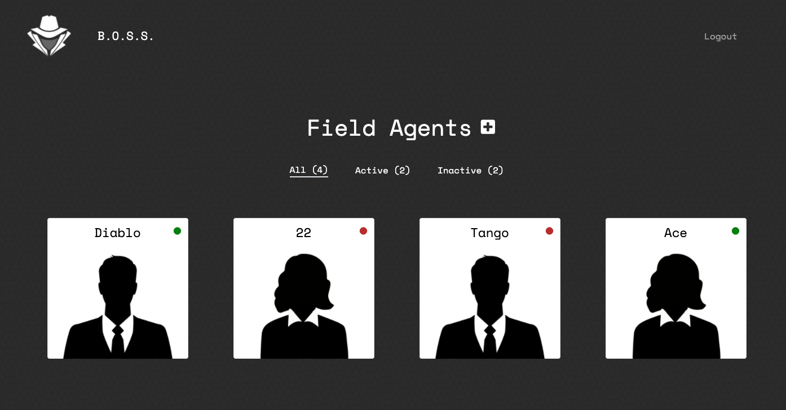

# Mission Tracker

## Description
  
Undercover is a Full Stack Web Application which allows users to create an admin secret agency account with subsequent field agents to manage. Users can create, update, and terminate their field agents in a secure, clean, and attractive platform. This app was created as a group and showcases responsiveness, interactiveness, authentication and authorization, database manipulation, and follows the MVC architectural paradigm.

## Functionality

* Users must create an account and login to access their dashboard.
* Once logged in, users gain access to their agency's portal where they can create, update, and terminate field agents.

## NPM Packages Used

* mysql2
* sequelize
* bcrypt
* dotenv
* express
* express-handlebars
* express-sessions
* connect-session-sequelize

## Installation

1) Open your terminal and install dependencies with:

        npm install

2) Update the .env.EXAMPLE file with your SQL and Secret info, and remove '.EXAMPLE' from the file name. 
3) Open the /db folder and copy/paste the provided schema into MySQLWorkbench or comparable program.
4) Run the following seed command in your terminal to add seed users and agents:
        
        npm run seed

5) Start the local server and open localhost:8080 in your browser:

        node server.js

## Live App

Link to the live Heroku application is [here](https://calm-atoll-65386.herokuapp.com/).

## Credits

[Scott Strittmatter](https://github.com/mrpancakes) | [Nate Griggs](https://github.com/nateghsc09) | [Emily Metzgar](https://github.com/emilymetzgar)

## License

Copyright (c) [2021] [Scott Strittmatter, Nate Griggs, Emily Metzgar SMU Coding Bootcamp]

Permission is hereby granted, free of charge, to any person obtaining a copy
of this software and associated documentation files (the "Software"), to deal
in the Software without restriction, including without limitation the rights
to use, copy, modify, merge, publish, distribute, sublicense, and/or sell
copies of the Software, and to permit persons to whom the Software is
furnished to do so, subject to the following conditions:

The above copyright notice and this permission notice shall be included in all
copies or substantial portions of the Software.

THE SOFTWARE IS PROVIDED "AS IS", WITHOUT WARRANTY OF ANY KIND, EXPRESS OR
IMPLIED, INCLUDING BUT NOT LIMITED TO THE WARRANTIES OF MERCHANTABILITY,
FITNESS FOR A PARTICULAR PURPOSE AND NONINFRINGEMENT. IN NO EVENT SHALL THE
AUTHORS OR COPYRIGHT HOLDERS BE LIABLE FOR ANY CLAIM, DAMAGES OR OTHER
LIABILITY, WHETHER IN AN ACTION OF CONTRACT, TORT OR OTHERWISE, ARISING FROM,
OUT OF OR IN CONNECTION WITH THE SOFTWARE OR THE USE OR OTHER DEALINGS IN THE
SOFTWARE.