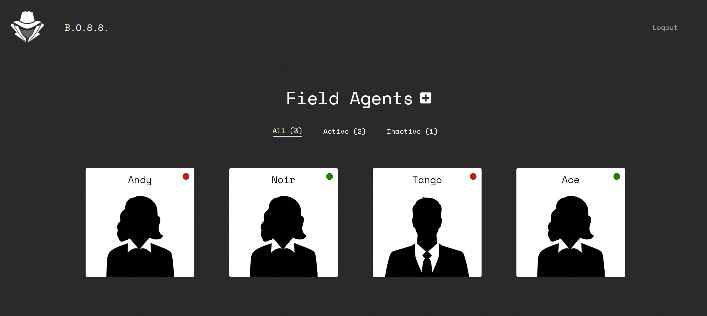

# Mission Tracker

## Description
  
A real world Full Stack Web Application called Mission Tracker. Mission Tracker allows users to create a profile, create agents in their profile, and update agent tracking information in a clean and attractive platform. This app was created as a group and show cases responsiveness, interactiveness, authentication and authorization, database manipulation,  and follows the MVC architectural paradigm.   

## Installation

Open terminal and install dependencies "npm install". Set up data base in MySQL. Create .env file with your info. When you are ready to go, run "npm run seed" in the terminal and then "node server.js".

## Usage

Open browser and go to URL https://localhost:8080

link to application: https://calm-atoll-65386.herokuapp.com/

## Credits

Scott Strittmatter | Nate Griggs | Emily Metzgar  

## License

MIT License

Copyright (c) [2021] [Scott Strittmatter, Nate Griggs, Emily Metzgar SMU Coding Bootcamp]

Permission is hereby granted, free of charge, to any person obtaining a copy
of this software and associated documentation files (the "Software"), to deal
in the Software without restriction, including without limitation the rights
to use, copy, modify, merge, publish, distribute, sublicense, and/or sell
copies of the Software, and to permit persons to whom the Software is
furnished to do so, subject to the following conditions:

The above copyright notice and this permission notice shall be included in all
copies or substantial portions of the Software.

THE SOFTWARE IS PROVIDED "AS IS", WITHOUT WARRANTY OF ANY KIND, EXPRESS OR
IMPLIED, INCLUDING BUT NOT LIMITED TO THE WARRANTIES OF MERCHANTABILITY,
FITNESS FOR A PARTICULAR PURPOSE AND NONINFRINGEMENT. IN NO EVENT SHALL THE
AUTHORS OR COPYRIGHT HOLDERS BE LIABLE FOR ANY CLAIM, DAMAGES OR OTHER
LIABILITY, WHETHER IN AN ACTION OF CONTRACT, TORT OR OTHERWISE, ARISING FROM,
OUT OF OR IN CONNECTION WITH THE SOFTWARE OR THE USE OR OTHER DEALINGS IN THE
SOFTWARE.